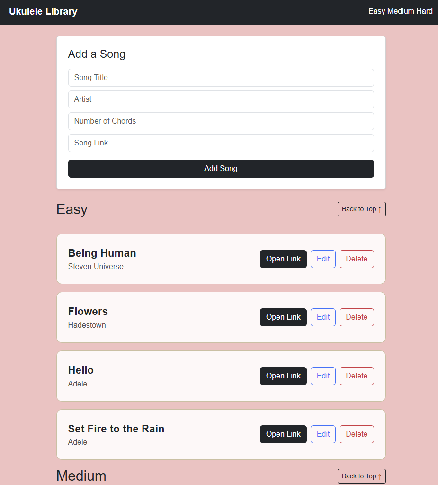
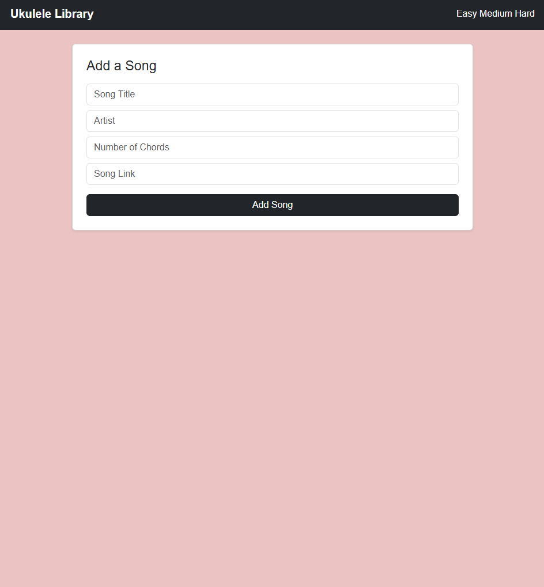
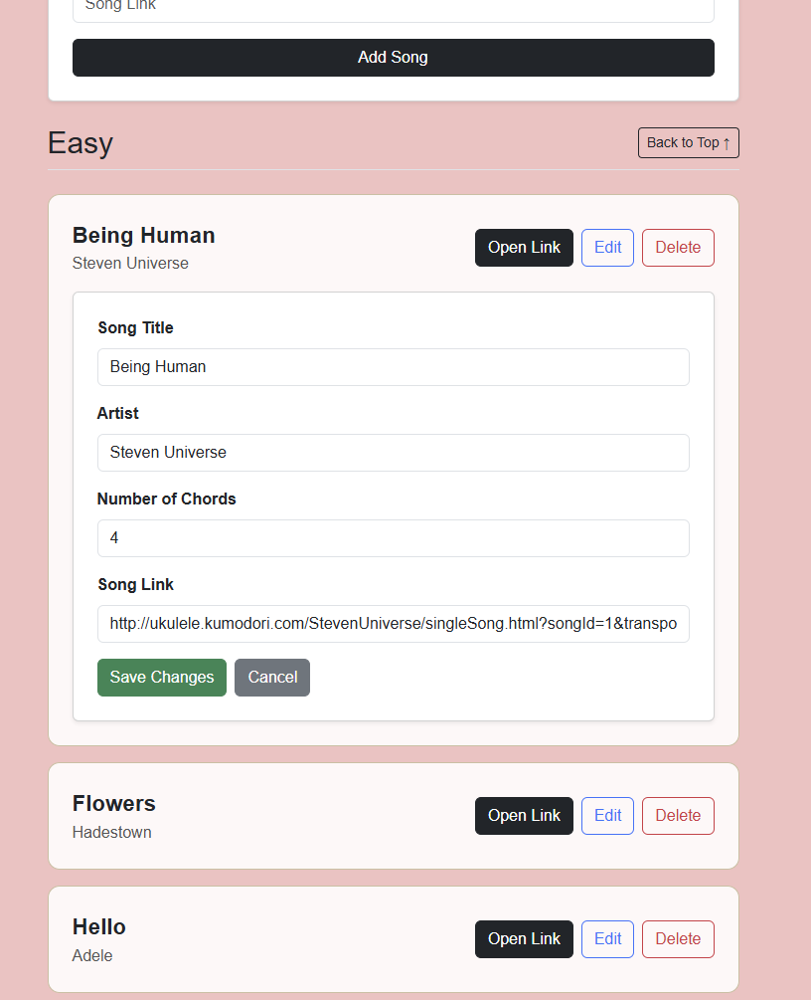
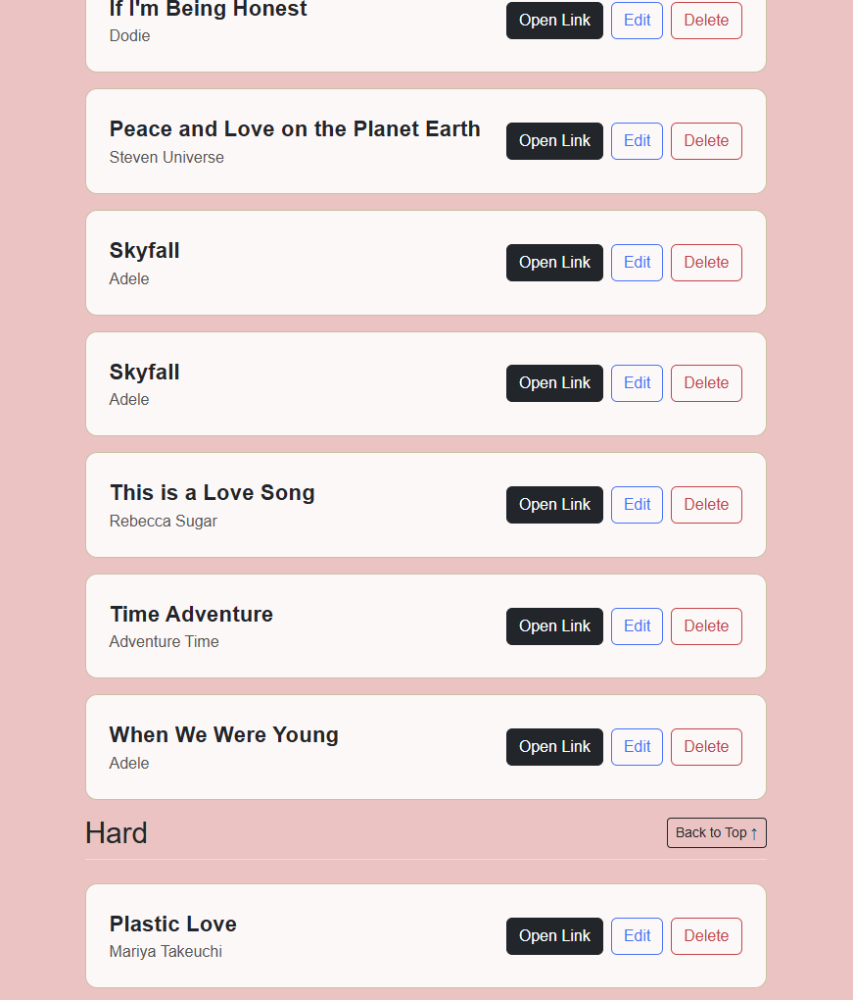

# Ukulele Library 

A simple full-stack web application for organizing ukulele songs by difficulty.
Users can add, edit, view, and delete songs, while the application automatically categorizes them as **Easy**, **Medium**, or **Hard** based on the number of chords.

This project was built using **FastAPI for the backend** and **HTML, JavaScript, and Bootstrap for the frontend**.

---

## Features

* Add new songs to the library
* Automatically categorize songs by difficulty

  * Easy: 6 chords or fewer
  * Medium: 7–12 chords
  * Hard: 13+ chords
* Edit existing songs with an inline edit form
* Delete songs from the library
* Open external song links
* Songs are automatically sorted alphabetically by song title
* Smooth scrolling navigation between difficulty sections

---

## Tech Stack

### Backend

* Python
* FastAPI
* Pydantic
* Uvicorn

### Frontend

* HTML5
* JavaScript (XMLHttpRequest)
* Bootstrap 5
* CSS

---

## Project Structure

```
project-folder/
│
├── main.py
├── ukulele_routes.py
├── song.py
├── User.py
├── requirements.txt
│
├── frontend/
│   ├── index.html
│   ├── main.js
│   ├── style.css
│   └── favicon.ico
│
├── README.md
└── screenshots/
    ├── UkuleleLibraryFrontPage_bottom.png
    ├── UkuleleLibraryFrontPage_default.png
    ├── UkuleleLibraryFrontPage_edit.png
    └── UkuleleLibraryFrontPage_top.png
```

---

## Installation

### 1. Clone the repository

```bash
git clone https://github.com/Etling-S/ukulele-library.git
cd ukulele-library
```

### 2. Create a virtual environment

```bash
python -m venv venv
```

Activate it:

**Windows**

```bash
venv\Scripts\activate
```

**Mac/Linux**

```bash
source venv/bin/activate
```

### 3. Install dependencies

```bash
pip install -r requirements.txt
```
### 4. Make sure MonoDB is running locally


---

## Running the Application

Start the FastAPI server:

```bash
uvicorn main:app --reload
```

Open your browser and go to:

```
http://127.0.0.1:8000
```

The frontend will load automatically.

---

## API Endpoints

### Authentication

```
POST /signup

POST /token
```


---

### Get All Songs

```
GET /library
```

Returns the full list of songs.

---

### Create Song

```
POST /library
```

Example request body:

```json
{
  "title": "Somewhere Over the Rainbow",
  "artist": "Israel Kamakawiwoʻole",
  "number_of_chords": 4,
  "link": "https://example.com"
}
```

---

### Get Song by ID

```
GET /library/{id}
```

---

### Update Song

```
PUT /library/{id}
```

Updates an existing song.

---

### Delete Song

```
DELETE /library/{id}
```

Removes a song from the library.

---

## How Difficulty is Determined

Difficulty is calculated automatically based on the number of chords:

| Chords | Difficulty |
| ------ | ---------- |
| 0–6    | Easy       |
| 7–12    | Medium     |
| 13+     | Hard       |

---
## Screenshots

### Main Library View

Displays the full ukulele song library organized by difficulty level (Easy, Medium, Hard). Songs are automatically sorted alphabetically and include quick access to edit, delete, and external links.



---

### Adding a New Song


Users can add a song by entering the title, artist, number of chords, and a link. The application validates the input before sending it to the backend.



---

### Editing a Song

Clicking **Edit** opens an inline editing form where users can update song details. The form includes labeled fields for clarity.



---

### Difficulty Sections

Songs are automatically categorized based on the number of chords:

* **Easy** (0–4 chords)
* **Medium** (5–8 chords)
* **Hard** (9+ chords)



---

## Author

Sage Etling

Built as a full-stack learning project using FastAPI and JavaScript.
